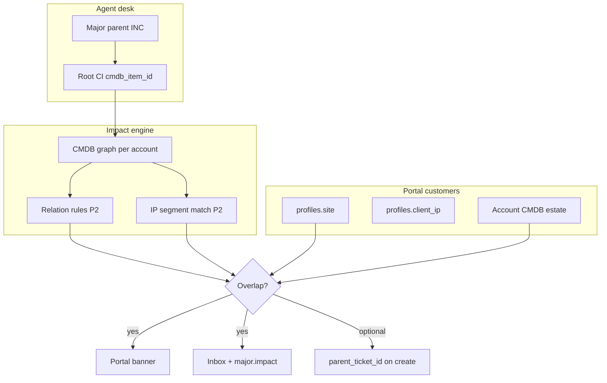

# GAMAS — CMDB impact detection

Deteksi otomatis **siapa terdampak major incident** berdasarkan graph CMDB, lokasi/site pengguna, dan subnet IP. Melengkapi parent/child ticket (bukan menggantikan RCA Problem).

**Companion:** [Major incident (user guide)](user-guide/major-incident.md) · [Demo klik 2 menit](DEMO-MAJOR-INCIDENT.md) · [Deploy](DEPLOYMENT.md)

---

## Ringkasan fitur (P0 → P2)

| Fase | Fitur | Siapa |
| --- | --- | --- |
| **P0** | `cmdb_item_id` di tiket induk, API dampak, banner portal | Agent + customer |
| **P1** | `profiles.site`, auto-link child saat buat tiket, notifikasi inbox/email/WA | Agent + customer |
| **P2** | Traversal relasi berarah, match subnet `ip_segments` + `profiles.client_ip` | Agent + customer |

---

## Arsitektur



---

## Database

Migrations (urutan):

| File | Isi |
| --- | --- |
| `20250901100000_ticket_cmdb_item.sql` | `tickets.cmdb_item_id` → root CI major |
| `20250901120000_profile_site.sql` | `profiles.site` — cabang default portal |
| `20250901130000_profile_client_ip.sql` | `profiles.client_ip` — IPv4 workstation |

Seed demo (Bank Nusantara, idempotent):

- Parent *WAN Bank Nusantara putus* → CI `bank-wan-indosat` (`bbbbbbbb-…-000000000013`)
- Customer `customer@novacrm.app` → site `Jakarta HQ`, IP `10.20.3.41`

---

## Aturan relasi CMDB (P2)

Traversal **berarah** dari root CI yang gagal (`lib/cmdb/impact-rules.ts`):

| Arah | Tipe relasi | Arti |
| --- | --- | --- |
| Outbound | `connects`, `protects`, `hosts` | Dampak ke downstream |
| Inbound | `depends_on`, `uses`, `runs_on`, `hosted_on` | Dependent ikut terdampak |
| Bidirectional | `connects` | Link jaringan — kedua arah |

Panel CMDB agent (*Impact if this CI is down*) memakai aturan yang sama. Graph explorer lama (undirected BFS) tidak dipakai untuk GAMAS.

Contoh chain seed Bank:

`bank-wan-indosat` → connects → `bank-fw-hq` → protects → `bank-core-sw` → connects → access/AP → endpoint `uses` access.

---

## IP subnet matching (P2)

1. Load `ip_segments` per account (CIDR terikat `cmdb_item_id`).
2. Expand dampak dari root CI (relasi berarah).
3. Match jika:
   - `profiles.client_ip` ∈ subnet CI terdampak, atau
   - `attributes.ip` pada CI endpoint account ∈ subnet terdampak.

Subnet demo: Users Lt.3 `10.20.3.0/24` pada `bank-acc-lt3`; laptop finance `10.20.3.41`.

---

## API

### `GET /api/majors/affecting-me`

Auth: session (customer atau agent). Permission: read Ticket.

| Query | Keterangan |
| --- | --- |
| `location` | Opsional — lokasi dari form insiden (≥3 karakter) |
| `accountId` | Opsional — wajib untuk agent (scope account switcher) |

Response:

```json
{
  "data": [
    {
      "id": "uuid",
      "number": "INC0000018",
      "title": "WAN Bank Nusantara putus",
      "status": "in_progress",
      "cmdbItemId": "uuid",
      "cmdbItemName": "bank-wan-indosat",
      "matchReason": "ci_overlap | location | site | ip_subnet | child_ticket"
    }
  ],
  "error": null
}
```

### `GET/PATCH /api/portal/profile`

Customer only. `PATCH` body: `{ "site": "Jakarta HQ", "clientIp": "10.20.3.41" }`.

---

## UI

### Agent

1. Buka incident induk → sidebar **Root CI (major impact)** → pilih CI (mis. `bank-wan-indosat`) → **Simpan CI akar**.
2. Saat **buat incident baru**: isi **Lokasi / cabang** → banner GAMAS → centang **Tautkan tiket ini sebagai child GAMAS**.
3. CMDB detail: panel impact menampilkan CI terdampak sesuai relasi berarah.

### Portal customer

1. **Beranda** — banner merah jika terdampak GAMAS aktif.
2. **Account** — simpan site + IP workstation.
3. **Laporkan insiden** — banner + opsi link child ke parent.

---

## Notifikasi (P1)

Trigger (`lib/tickets/major-notify.ts`):

- Root CI diset atau diubah pada incident induk (bukan child).
- Status parent major berubah.

Saluran:

- In-app inbox (`kind: status`)
- Email / WhatsApp via queue event `major.impact` (per user terdampak)

**Syarat:** worker + `SUPABASE_SERVICE_ROLE_KEY` di environment production.

---

## Deploy

Setelah `git pull` di VPS:

```bash
cd /opt/novacrm
DATABASE_URL='postgresql://...' sh scripts/migrate.sh
docker compose pull
docker compose up -d --force-recreate web worker
```

Verifikasi kolom:

```sql
select column_name from information_schema.columns
where table_name = 'tickets' and column_name = 'cmdb_item_id';

select site, client_ip from profiles
where email = 'customer@novacrm.app';
```

---

## Uji cepat (demo Bank)

| # | Langkah | Expected |
| --- | --- | --- |
| 1 | Agent: Bank → *WAN Bank Nusantara putus* → Root CI = `bank-wan-indosat` | Tersimpan |
| 2 | Login `customer@` → `/portal` | Banner GAMAS |
| 3 | Portal → Account → site + IP `10.20.3.41` | Tersimpan |
| 4 | Portal → Laporkan insiden → centang link GAMAS → submit | Child + badge **Anak** |
| 5 | Agent: ubah status parent | Customer dapat inbox (jika worker jalan) |

---

## File kode utama

| Path | Peran |
| --- | --- |
| `lib/tickets/major-context.ts` | Load graph + segments, match majors |
| `lib/tickets/major-impact.ts` | API server actions |
| `lib/tickets/major-notify.ts` | Notifikasi user terdampak |
| `lib/cmdb/impact-rules.ts` | Aturan relasi P2 |
| `lib/cmdb/ip-match.ts` | CIDR / IPv4 match |
| `lib/cmdb/graph.ts` | Graph builder + location helper |
| `components/portal/portal-major-alert.tsx` | Banner + hook fetch |
| `app/api/majors/affecting-me/route.ts` | REST endpoint |

---

## Batasan & best practice

- **Satu tingkat** parent/child — tidak ada cucu.
- Root CI **wajib** diisi agent agar deteksi otomatis akurat (fallback: `asset_id` → CI terkait).
- Tanpa `site` / `client_ip`, customer tetap bisa match via overlap CI account (lebih luas).
- GAMAS ≠ Problem RCA — jangan campur panel **Related problem** dan **Major incident**.
- Notifikasi massal hanya ke portal users account yang match — bukan broadcast tenant.
