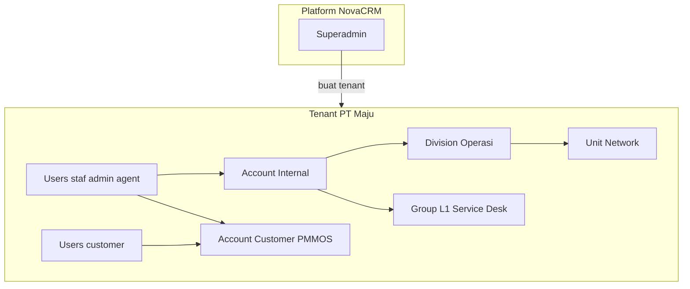
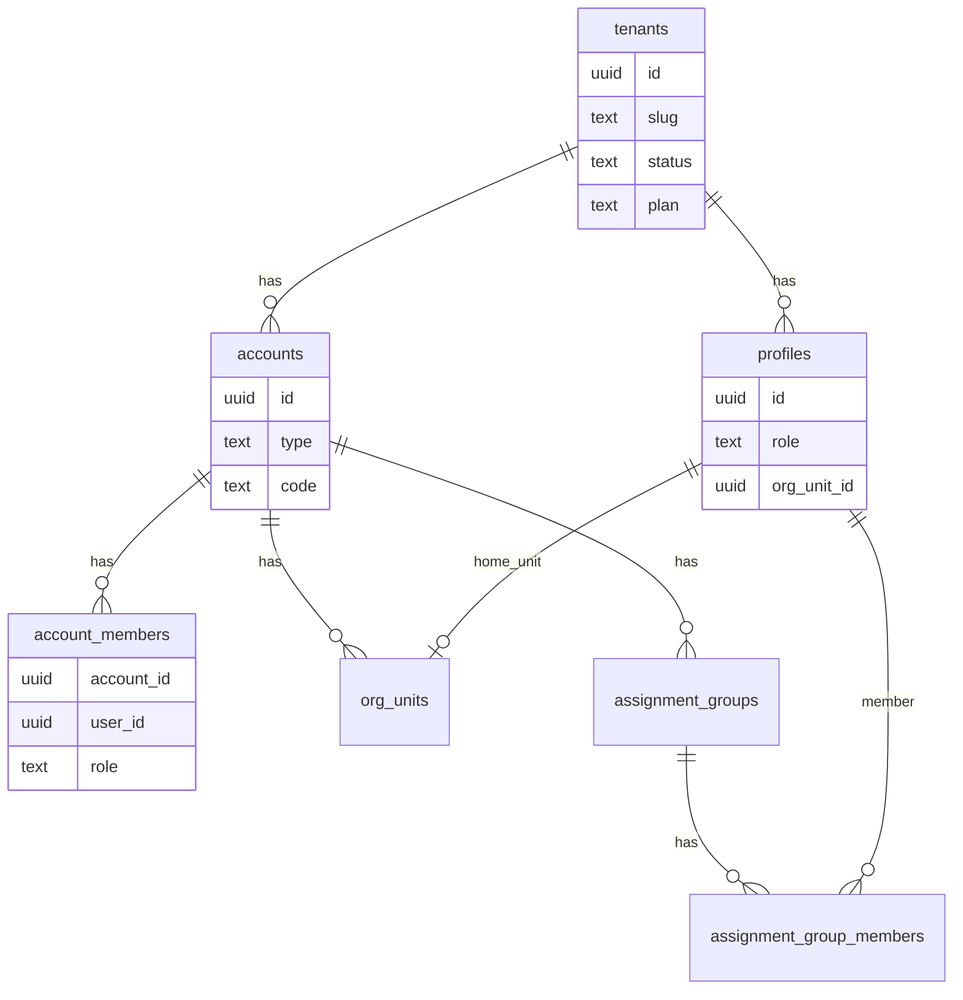
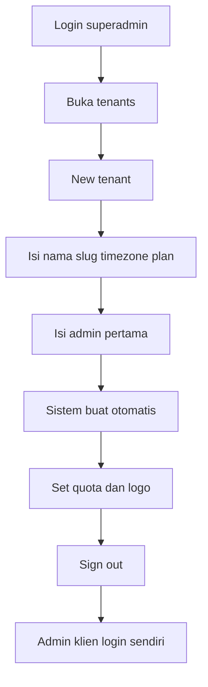
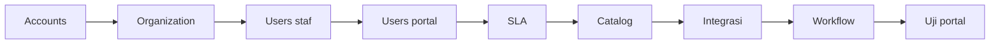
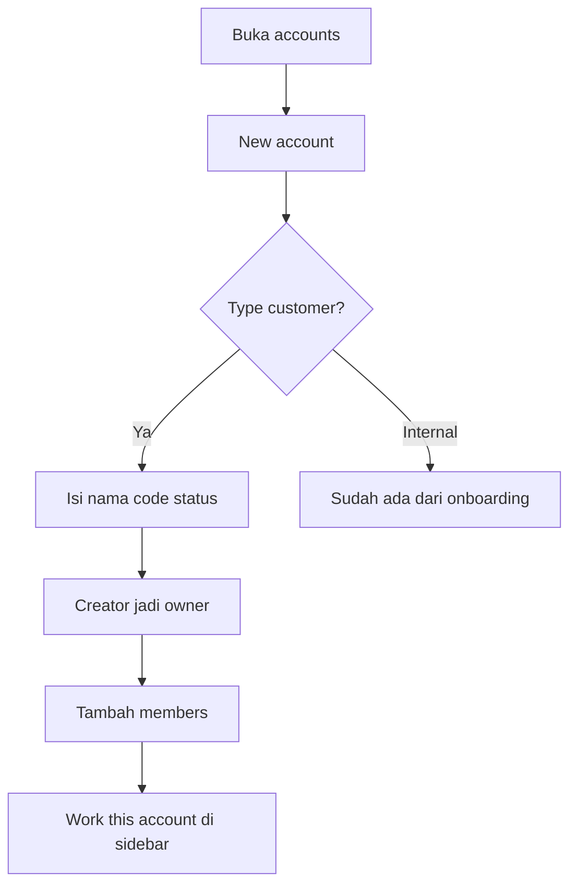
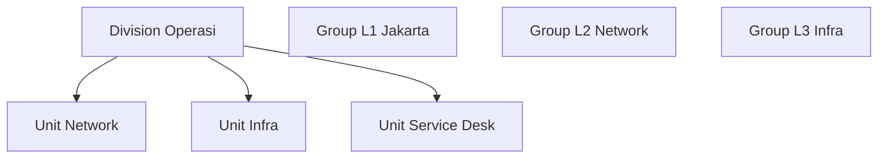
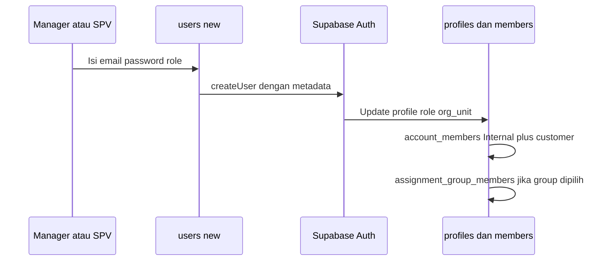
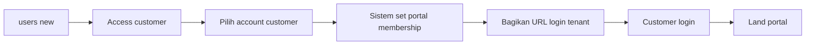
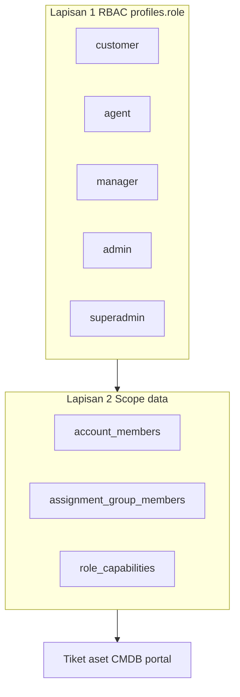
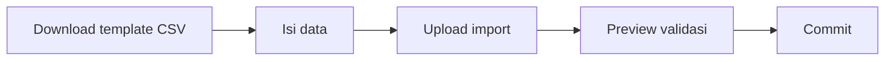

# NovaCRM — Journey Tenant, Account, User & Organisasi

**Audience:** superadmin, admin, manager, supervisor, trainer  
**Tujuan:** peta end-to-end menyiapkan workspace klien — dari tenant baru sampai customer bisa login portal  
**Companion:** [Operasi tenant](user-guide/tenant-operations.md) · [Admin sistem](user-guide/admin-system.md) · [Superadmin](user-guide/superadmin.md) · [RBAC](RBAC.md) · [Ticketing journey](TICKETING-JOURNEY.md)

---

## 1. Istilah — jangan tertukar

Satu aplikasi web. Isolasi data = `tenant_id`. Bukan subdomain per klien, bukan database per klien.

| Istilah | Apa | Contoh | Menu |
| --- | --- | --- | --- |
| **Tenant** | Workspace klien di platform | PT Maju, lab `novacrm-demo` | `/tenants` (superadmin) |
| **Account** | Domain kerja di dalam tenant | Internal · Bank Nusantara | `/accounts` |
| **Division** | Divisi staf (level atas org) | Divisi Operasi | `/org` |
| **Unit** | Departemen di bawah divisi | Dept Network | `/org` |
| **Assignment group** | Antrian tiket L1/L2/L3 | Service Desk, L2 Network | `/org` → New group |
| **User staf** | Login desk (`admin` … `agent`) | Manager, agent L1 | `/users` |
| **User portal** | Login customer | Pemakai layanan klien | `/users` → Access `customer` |
| **Portal** | UI pemakai akhir | Katalog, tiket sendiri | `/portal` |

**PMMOS** di halaman Accounts = **account customer**, bukan tenant. Archive PMMOS ≠ hapus tenant.

---

## 2. Model data (ringkas)

| Tabel | Fungsi |
| --- | --- |
| `tenants` | Workspace klien, plan, quota, kontrak, logo |
| `accounts` | Internal (satu per tenant) + customer (banyak) |
| `account_members` | Scope data: `owner` · `member` · `portal` |
| `profiles` | Role RBAC, home unit, site/IP portal |
| `org_units` | Division → Unit (hierarki Internal) |
| `assignment_groups` | Antrian tiket + tier L1/L2/L3 |
| `assignment_group_members` | Keanggotaan antrian |
| `role_capabilities` | Override hak per tenant |

---

## 3. Siapa boleh apa

| Tugas | Role minimum |
| --- | --- |
| Buat / pause / archive **tenant** | `superadmin` |
| Logo brand tenant | `superadmin` → `/tenants/{id}` |
| Integrasi, notifikasi, Appearance | `admin` |
| Account, org, import massal | `manager` |
| User `customer` / `agent` | `supervisor` |
| User sampai `supervisor` | `manager` |
| User `admin` | `admin` |
| Portal (buat tiket sendiri) | `customer` |

**Siapa bisa assign role ke siapa:**

| Pembuat | Boleh assign |
| --- | --- |
| `superadmin` | Semua role |
| `admin` | Semua kecuali `superadmin` |
| `manager` | customer, agent, pm_delivery, dco, team_lead, supervisor |
| `supervisor` | customer, agent |

`admin@novacrm.app` **tidak** melihat `/tenants`. Pakai `superadmin@novacrm.app`.

---

## 4. Journey Superadmin — buat tenant baru

### Langkah detail

| # | Rute | Aksi | Hasil otomatis |
| --- | --- | --- | --- |
| 1 | `/login` | Login `superadmin@…` | Akses platform |
| 2 | `/tenants` | **New tenant** | Form onboarding |
| 3 | Form | Nama, slug, accent, timezone, support email, plan, kontrak, grace | Record `tenants` |
| 4 | Form | Admin pertama: nama, email, password | Bukan user portal |
| 5 | Sistem | `createTenant()` | Lihat tabel di bawah |
| 6 | `/tenants/{id}` | Usage quotas, logo brand | Monitor di `/settings/usage` |
| 7 | — | **Sign out** | Jangan pakai superadmin harian |

**Yang dibuat otomatis saat tenant baru:**

| Objek | Detail |
| --- | --- |
| Account **Internal** | Code `INT`, slug `internal` |
| Admin pertama | Role `admin`, owner Internal |
| Group **Service Desk** | L1, admin sebagai lead |
| SLA | Kalender office hours + 16 target type×priority |
| WFM | Template shift default |

**Login klien:** `https://novacrm.click/login?tenant={slug}`  
**API:** `https://novacrm.click/api/v1/t/{slug}`

**Status tenant:** `active` · `paused` · `archived` — login ditolak jika paused/archived atau kontrak habis + grace.

---

## 5. Journey Admin — setup tenant (urutan wajib)

Kerjakan sebagai **admin tenant klien** setelah superadmin selesai. Jangan buka portal sebelum langkah 5–6.

| Urutan | Menu | Tujuan |
| --- | --- | --- |
| 1 | `/accounts` | Customer (PMMOS, Bank, …) |
| 2 | `/org` | Division, unit, group L1/L2/L3 — **switcher Internal** |
| 3 | `/users` | Staf desk: agent, lead, SPV, manager |
| 4 | `/users` | Portal: role `customer` |
| 5 | `/sla` | Matriks per account customer |
| 6 | `/catalog` | Item Request, Incident, Standard change |
| 7 | `/settings` | AI, WA, Telegram, email |
| 8 | `/settings/notifications` | Channel + uji kirim |
| 9 | `/workflows` | Auto-assign, notify |
| 10 | `/governance` | Privasi portal (off sampai Enable) |

Branding tenant (nama, accent, MFA): `/settings/tenant` — bukan `/tenants`.

---

## 6. Journey Account (customer domain)

| Field | Arti |
| --- | --- |
| Name | Nama perusahaan / klien |
| Type | `customer` (UI hanya ini; `internal` sudah ada) |
| Code | Opsional, untuk import CSV |
| Status | `Active` · `Paused` · `Archived` |

**Membership account:**

| Role member | Arti |
| --- | --- |
| `owner` | Penanggung jawab account |
| `member` | Staf desk yang boleh lihat account ini |
| `portal` | User customer portal di account ini |

**Visibility:** Manager+ lihat semua account. Agent hanya account tempat di-member-kan.

**Tidak ada Delete account** — archive saja. Tiket, aset, CI, audit tetap terikat.

**Quota:** `max_accounts` dari plan tenant — create ditolak saat cap tercapai.

---

## 7. Journey Organisasi (Internal)

Org tree hanya untuk account **Internal**. Jika switcher di PMMOS: pesan *Org tree is for Internal staff* — pindah ke Internal.

| Objek | Rute | Field utama |
| --- | --- | --- |
| Division | `/org/units/new?type=division` | Name, manager opsional |
| Unit (dept) | `/org/units/new?type=unit` | Name, **parent division**, manager |
| Assignment group | `/org/groups/new` | Nama, kind, tier L1/L2/L3, OLA, party |

**Pisahkan konsep:**

| Konsep | Untuk apa |
| --- | --- |
| **Division / Unit** | Home unit HR (kartu organisasi user) |
| **Assignment group** | Antrian tiket, filter **My groups**, WFM dispatch |

User staf: set **Home unit** = dept. Set **Groups** = antrian L1/L2/L3.

---

## 8. Journey User — staf desk

| Field | Staf desk |
| --- | --- |
| Email / password | Login desk |
| Access | agent · team_lead · supervisor · manager · admin |
| Home unit | Dept dari `/org` |
| Groups | L1/L2/L3, **My groups** |
| Account membership | Customer account yang boleh dilihat |

**Otomatis:** Staf non-customer selalu dapat membership **Internal** + account target jika dipilih.

**Quota:** `max_agents` — create agent ditolak saat cap.

---

## 9. Journey User — portal customer

| Field | Portal |
| --- | --- |
| Email / password | Login pemakai |
| Access | **`customer`** |
| Account | Account type **customer** (PMMOS, Bank, …) |

**URL:** `https://novacrm.click/login?tenant={slug}`  
Setelah Sign in → `/portal` (bukan desk).

### First login customer

| Langkah | Rute | Perilaku |
| --- | --- | --- |
| 1 | `/login` | Redirect ke `/portal?welcome=1` |
| 2 | `/portal` | My tickets, catalog |
| 3 | `/portal/account` | Site, IP workstation (GAMAS), ganti password |
| 4 | `/portal/catalog` | Ajukan request terstruktur |
| 5 | `/portal/new` | Tiket bebas |
| 6 | `/portal/privacy` | DSAR jika governance aktif |

**Aturan password:** wajib ganti setiap 30 hari. Jika kedaluwarsa, hanya halaman ganti password yang terbuka.

**Jangan** pakai `customer@novacrm.app` di tenant produksi — buat user baru per tenant.

---

## 10. Dua lapisan akses (RBAC + scope data)

| Lapisan | Storage | Mengatur |
| --- | --- | --- |
| **App role** | `profiles.role` | Menu, CASL, RLS helper |
| **Account membership** | `account_members` | Tiket/aset/CMDB per customer |
| **Group membership** | `assignment_group_members` | Antrian, auto-assign WFM |
| **Capability override** | `role_capabilities` | Fine-tune per tenant (`/settings/capabilities`) |

**Manager+** bypass membership — lihat semua account tenant.  
**Customer** auto-scope ke account customer pertama.

Detail matriks: [RBAC.md](RBAC.md) · [capability-matrix.md](user-guide/capability-matrix.md)

---

## 11. Journey Import massal

**Rute:** `/import` → pilih jenis → preview → commit

| Kind | Permission | Upsert key | Buat auth user? |
| --- | --- | --- | --- |
| `accounts` | create Account | slug atau code | Tidak |
| `users` | create User | email | Ya (baris baru) |
| `assets` | create Asset | assetTag | Tidak |
| `cmdb` | create Cmdb | name+type+account | Tidak |
| `ip_segments` | create Cmdb | cidr+account | Tidak |
| `tickets` | create Ticket | insert only | Tidak |

**Users import:** baris existing hanya update nama/phone/role — password tidak wajib.  
**Kolom users:** fullName, email, role, password, phone, accountCode

Butuh `SUPABASE_SERVICE_ROLE_KEY` untuk create user.

---

## 12. Journey nonaktifkan dan arsip

| Yang ingin dihentikan | Cara | Data |
| --- | --- | --- |
| Account tidak dipakai | Status **Archived** di `/accounts/{id}` | Tetap ada, tidak dihapus |
| Orang keluar dari account | **Remove** di Members | Login user tetap |
| User tidak boleh masuk | Nonaktifkan di `/users/{id}` | Jejak tiket tetap |
| Seluruh klien | Superadmin **Pause** atau **Archive** tenant | Tidak dihapus |
| Kontrak habis | `expires_at` + grace → login ditolak | Worker bisa auto-pause |

Tenant **protected** (lab `novacrm-demo`) tidak bisa di-pause dari UI.

---

## 13. Matriks journey per persona

| Persona | Mulai dari | Journey utama | Selesai di |
| --- | --- | --- | --- |
| **Superadmin** | `/tenants/new` | Tenant + admin pertama + quota | Sign out, serahkan ke admin |
| **Admin** | Login `?tenant=slug` | Accounts → org → users → SLA → catalog → integrasi | Agent dan customer bisa kerja |
| **Manager** | `/accounts`, `/org`, `/import` | Customer account + org + bulk user | Staf ter-scope benar |
| **Supervisor** | `/users/new` | Agent + customer | Portal user bisa login |
| **Customer** | URL login tenant | Portal catalog atau new request | CSAT setelah resolved |
| **Trainer** | Clone urutan §5 | Lab satu tenant lengkap | Checklist §14 lulus |

---

## 14. Checklist uji satu tenant baru

- [ ] Login `?tenant={slug}` sebagai admin klien berhasil
- [ ] `/accounts`: Internal + minimal satu customer
- [ ] `/org` (Internal): division, unit, group L1
- [ ] `/users`: agent dengan home unit + group; customer terikat account customer
- [ ] Agent switch ke customer account, buat tiket — tidak muncul di account lain
- [ ] Logout, login email customer → mendarat `/portal`
- [ ] Archive customer account: status archived, tidak ada tombol Delete
- [ ] `/settings/usage` quota terbaca
- [ ] Import CSV users (opsional) berhasil

---

## 15. Data demo (tenant lab)

**Tenant:** slug `novacrm-demo` · protected enterprise  
**Password semua:** `NovaCRM!2026`

| Email | Role | Lands on |
| --- | --- | --- |
| `superadmin@novacrm.app` | superadmin | `/dashboard` |
| `admin@novacrm.app` | admin | `/dashboard` |
| `manager@novacrm.app` | manager | `/dashboard` |
| `spv@novacrm.app` | supervisor | `/dashboard` |
| `lead@novacrm.app` | team_lead | `/dashboard` |
| `agent@novacrm.app` | agent | `/dashboard` |
| `customer@novacrm.app` | customer | `/portal` |

**Accounts lab:**

| Name | Code | Type |
| --- | --- | --- |
| Nova Internal | INT | internal |
| PT Bank Nusantara | BNK | customer |
| PT Garuda Logistics | GRD | customer |

**Org Internal:** Divisi Operasi → Network, Infra, Service Desk · Groups L1 Jakarta, L2 Network, L3 Infra

---

## 16. Masalah yang sering

| Gejala | Penyebab | Perbaikan |
| --- | --- | --- |
| `/tenants` hilang | Login admin, bukan superadmin | `superadmin@…` |
| Tidak ada New unit | Role agent atau switcher di customer | Manager + switcher **Internal** |
| Org kosong | Switcher di account customer | Pilih **Internal** |
| Customer masuk desk | Access bukan `customer` | Edit user |
| Portal lab di tenant baru | Pakai `customer@novacrm.app` | Buat user baru di tenant itu |
| Tidak bisa Delete account | Desain produk | Archive + Save |
| Create account ditolak | Quota habis | Superadmin naikkan quota atau plan |
| Agent tidak lihat Bank | Tidak di-member-kan | Tambah di account Members |

---

## 17. Rute dan kode referensi

| Area | Rute UI | Kode utama |
| --- | --- | --- |
| Tenants | `/tenants`, `/tenants/new`, `/tenants/{id}` | `lib/tenants/actions.ts` |
| Tenant settings | `/settings/tenant`, `/settings/usage` | `lib/tenants/meter.ts` |
| Accounts | `/accounts`, `/accounts/new`, `/accounts/{id}` | `lib/accounts/actions.ts` |
| Organization | `/org`, `/org/units/new`, `/org/groups/new` | `lib/org/actions.ts` |
| Users | `/users`, `/users/new`, `/users/{id}` | `lib/users/actions.ts` |
| Import | `/import` | `lib/import/actions.ts` |
| Capabilities | `/settings/capabilities` | `lib/rbac/capability-actions.ts` |
| Portal profile | `/portal/account` | `lib/profiles/portal-site.ts` |
| Auth | `/login`, `/select-account` | `lib/auth/actions.ts` |
| API tenants | `GET/POST /api/tenants` | `app/api/tenants/route.ts` |
| API portal | `GET/PATCH /api/portal/profile` | `app/api/portal/profile/route.ts` |

**Migrations kunci:** `20250813000000_foundation.sql` · `20250814010000_accounts.sql` · `20250814020000_org_groups.sql` · `20250814140100_rbac.sql` · `20250817140000_tenant_administration.sql` · `20250820130000_tenant_quotas.sql`

---

## 18. Hubungan ke modul lain

Setelah tenant + user siap, lanjutkan ke:

| Modul | Dokumen |
| --- | --- |
| Ticketing end-to-end | [TICKETING-JOURNEY.md](TICKETING-JOURNEY.md) |
| Major incident GAMAS | [GAMAS-CMDB-IMPACT.md](GAMAS-CMDB-IMPACT.md) |
| Delivery project | [delivery-process.md](user-guide/delivery-process.md) |
| Demo presenter | [DEMO-E2E.md](DEMO-E2E.md) |
| SQL akses user di VPS | [SERVER-USER-ACCESS.md](SERVER-USER-ACCESS.md) |

---

*Terakhir diperbarui: September 2026*
