# NovaCRM — Journey Ticketing Lengkap

**Audience:** customer, agent, team lead, manager, admin, trainer  
**Tujuan:** peta end-to-end semua alur tiket di NovaCRM — dari pengajuan sampai penutupan, termasuk GAMAS, SLA, notifikasi, dan otomasi  
**Companion:** [User operator](user-guide/user-operator.md) · [Major incident](user-guide/major-incident.md) · [GAMAS CMDB](GAMAS-CMDB-IMPACT.md) · [Catalog](user-guide/catalog-guidance.md) · [Demo E2E](DEMO-E2E.md)

---

## 1. Peta besar

NovaCRM mengelola **empat proses ITSM** dalam satu mesin tiket:

| Proses | Prefix | Tujuan | Menu desk |
| --- | --- | --- | --- |
| **Incident** | `INC` | Gangguan layanan tidak terencana | Incidents |
| **Problem** | `PRB` | Akar penyebab / known error | Problems |
| **Change** | `CHG` | Perubahan terkontrol infrastruktur | Changes + CAB |
| **Request** | `RITM` | Permintaan katalog / akses | Requests |

**Tiga permukaan pengguna:**

| Permukaan | Role | Home | Apa yang bisa dilakukan |
| --- | --- | --- | --- |
| **Portal** | `customer` | `/portal` | Ajukan, lacak, komentar, CSAT |
| **Service desk** | `agent`, `team_lead`, `supervisor` | `/dashboard` → `/tickets` | Triage, kerjakan, escalate, major, RCA |
| **Konfigurasi tenant** | `admin`, `manager` | `/sla`, `/catalog`, `/workflows`, `/settings` | SLA, katalog, workflow, channel notifikasi |

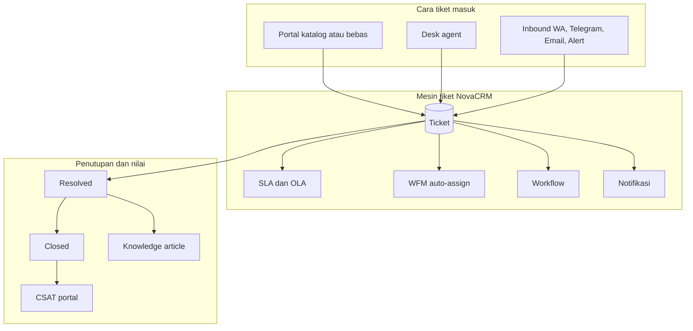

---

## 2. Status & prioritas (semua proses)

Status teknis sama di database; label UI berbeda per jenis proses.

| Status DB | Incident | Problem | Change | Request |
| --- | --- | --- | --- | --- |
| `open` | New | New | Draft | Submitted |
| `in_progress` | In Progress | Root Cause | Implement | Fulfillment |
| `waiting` | Waiting | Pending | CAB Review | Waiting |
| `hold` | On Hold | Known Error | Scheduled | On Hold |
| `resolved` | Resolved | Fix Ready | Review | Fulfilled |
| `closed` | Closed | Closed | Closed | Closed |

**Prioritas:** `low` · `medium` · `high` · `critical` — mempengaruhi target SLA.

**Alasan pending** (saat `waiting` / `hold`): `customer` · `vendor` · `change_freeze` + catatan bebas.

---

## 3. Journey Customer (Portal)

### 3.1 Onboarding & akses

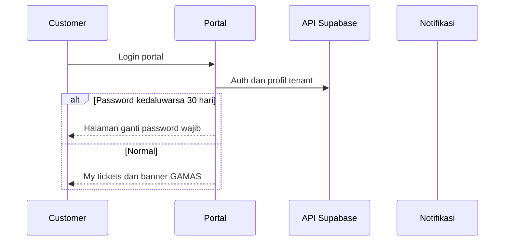

| Langkah | Rute | Hasil |
| --- | --- | --- |
| 1. Login | `/portal` | Lihat ringkasan tiket open / waiting / done |
| 2. (Opsional) Atur profil | `/portal/account` | Site & IP workstation — untuk deteksi GAMAS |
| 3. Lihat gangguan besar | Banner di home | Jika CMDB/site/IP cocok dengan major aktif |

**Login lab:** `customer@novacrm.app` / `NovaCRM!2026`

### 3.2 Ajukan tiket — dari katalog (disarankan)

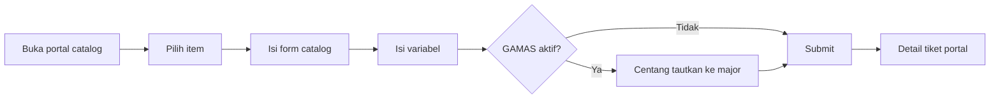

| Langkah | Detail |
| --- | --- |
| 1 | Buka **Catalog**, pilih item (VPN, Install software, …) |
| 2 | Isi field wajib (lokasi, alasan, …) |
| 3 | Jika banner GAMAS muncul saat create bebas — bisa centang **Tautkan sebagai anak major** |
| 4 | Submit → nomor `RITM…` atau `INC…` tergantung item |
| 5 | Notifikasi ke email/WA/Telegram jika channel aktif |

**Ask AI:** chat **Tanya AI** bisa menyarankan item katalog; konfirmasi sebelum submit.

### 3.3 Ajukan tiket — bebas (ad-hoc)

| Langkah | Rute | Detail |
| --- | --- | --- |
| 1 | `/portal/new` | Pilih **incident** (gangguan) atau **request** (permintaan umum) |
| 2 | Isi judul, lokasi, dampak, kontak, deskripsi | Incident default prioritas lebih tinggi |
| 3 | Panel Knowledge | Muncul jika judul mirip artikel — baca dulu hindari duplikat |
| 4 | Submit | Redirect ke detail tiket |

### 3.4 Lacak & berinteraksi

| Langkah | Aksi | Batasan customer |
| --- | --- | --- |
| 1 | `/portal` atau `/portal/{id}` | Lihat status, process strip, aktivitas |
| 2 | Tambah komentar | Hanya baca + komentar — tidak bisa ubah status/assign |
| 3 | Realtime | Daftar & detail update otomatis (Supabase Realtime) |
| 4 | Progress task | Read-only jika agent membuat task fulfillment |

### 3.5 Penutupan & CSAT

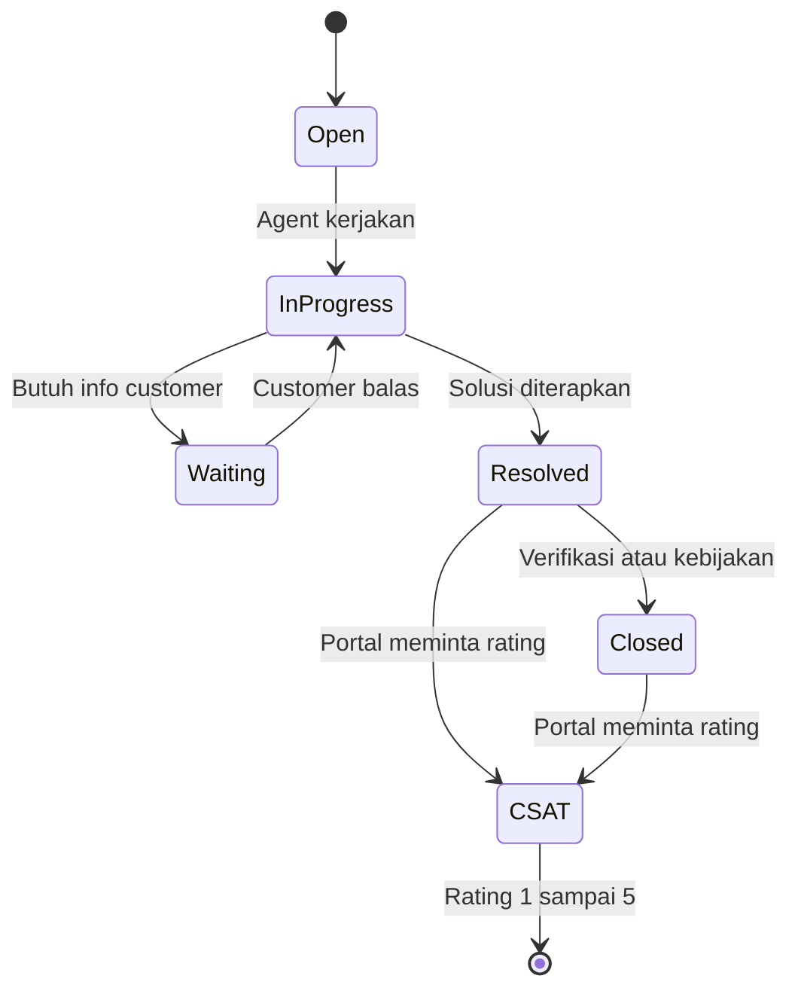

| Aturan CSAT | Perilaku |
| --- | --- |
| Wajib | Portal **terkunci** (katalog, new request, Ask AI) sampai semua tiket resolved/closed dinilai |
| Timeout | 7 hari kerja tanpa rating → sistem isi **5/5** otomatis |
| Tautan notifikasi | Selalu `/portal/{id}` — bukan URL desk |

### 3.6 Privasi (UU PDP)

Tab **Privacy** muncul jika admin mengaktifkan. Customer bisa ajukan DSAR (akses / hapus / keberatan) dari portal.

---

## 4. Journey Agent (Service Desk)

### 4.1 Mulai shift

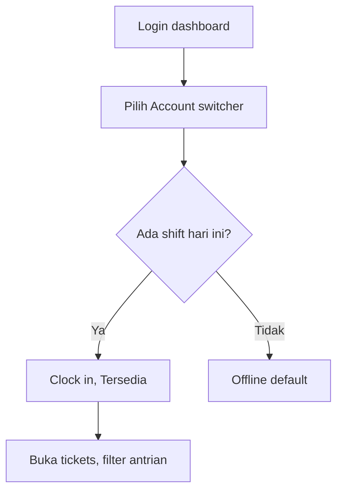

| Presence | Auto-assign tiket baru | SLA clock |
| --- | --- | --- |
| **Tersedia** | Ya | Jalan |
| **Sibuk / Istirahat** | Tidak | Jalan |
| **Offline** | Tidak | — |

**Login lab:** `agent@novacrm.app` atau `sari.l1@novacrm.app` / `NovaCRM!2026`

Detail lengkap WFM: [WFM-JOURNEY.md](../WFM-JOURNEY.md)

### 4.2 Triage antrian

| Filter | Arti |
| --- | --- |
| **All** | Semua tiket account terpilih |
| **Mine** | Assignee = saya |
| **My groups** | Group saya |
| **Unassigned** | Belum ada assignee — triage prioritas |

**Tampilan:** List (tabel padat + badge SLA) atau **Board** Kanban — seret kartu = ubah status.

**Chip KPI:** In queue · New · Unassigned · **SLA risk** — kerjakan Unassigned & SLA risk dulu.

**Menu proses:** Incidents · Problems · Changes · CAB · Requests · All tickets

### 4.3 Buat tiket (agent)

| Langkah | Detail |
| --- | --- |
| 1 | `⌘N` atau **New ticket** → `/tickets/new` |
| 2 | Pilih **jenis** (INC / PRB / CHG / RITM) |
| 3 | Pilih **Account** customer (wajib) |
| 4 | Judul, deskripsi, prioritas |
| 5 | Opsional: item katalog + variabel, aset, group, assignee, requester |
| 6 | **Change:** rencana implementasi + backout; Standard wajib katalog |
| 7 | **Major:** pilih parent atau set root CI nanti di detail |
| 8 | Save → SLA/OLA di-snapshot; workflow `ticket.create`; WFM dispatch jika kosong assignee |

### 4.4 Kerjakan tiket (detail 70/30)

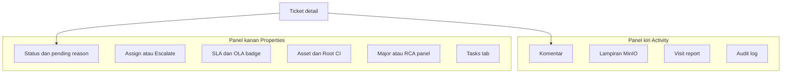

| Aksi | Kapan dipakai | Efek SLA |
| --- | --- | --- |
| **Assign to me** | Ambil kepemilikan | Response clock: komentar pertama = responded |
| **Update status** | Maju proses | Hold/waiting = **pause** |
| **Escalate L2/L3** | Butuh spesialis | SLA **tetap jalan** |
| **Hold + alasan** | Tunggu vendor/customer | SLA **pause** |
| **Komentar** | Update ke requester | Notifikasi `ticket.comment_add` |
| **Lampiran** | Bukti, screenshot | Tersimpan MinIO presigned |
| **Link aset** | Hardware terkait | Riwayat ITAM |
| **Root CI** | Major / GAMAS | CMDB impact ke portal |
| **Summarize (AI)** | Tiket panjang | Ringkasan 3 baris |
| **Publish knowledge** | Setelah resolved/closed | Artikel di `/knowledge` |

### 4.5 Journey per jenis proses

#### Incident (INC)

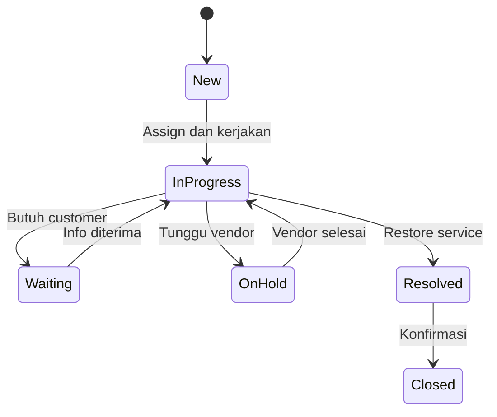

- Tautkan **aset** atau **Root CI** untuk impact analysis
- Tautkan ke **Problem** (RCA) — berbeda dari Major parent/child
- Outage skala besar → buat **Major parent** + tautkan anak

#### Request (RITM)

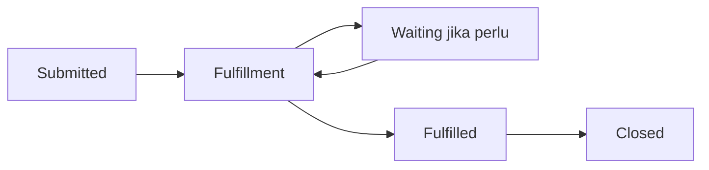

- Ideal dari **katalog** — variabel tersimpan di `catalog_answers`
- Task fulfillment otomatis dari definisi katalog (jika dikonfigurasi)
- Jangan closed sebelum requester konfirmasi (kebijakan SPV)

#### Problem (PRB)

- Tautkan incident terkait
- Isi **workaround** + flag **Known error**
- Status `hold` = Known Error di UI

#### Change (CHG)

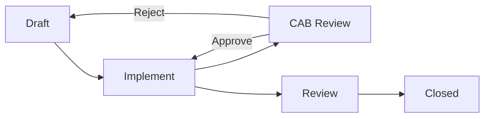

- **Normal / Emergency:** rencana + backout manual
- **Standard:** wajib item katalog
- Antrian CAB: `/cab` — approve / reject / defer

### 4.6 Major Incident (GAMAS) — journey agent

> Bukan RCA (`problem_id`). Ini `parent_ticket_id` — satu induk, banyak anak.

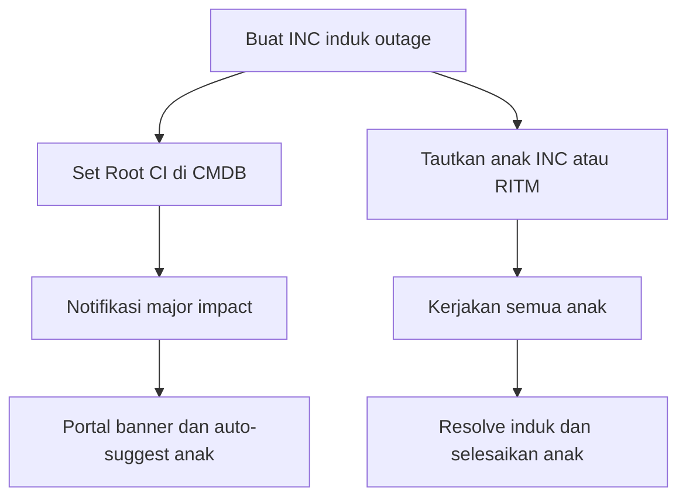

| Langkah | UI | Aturan |
| --- | --- | --- |
| 1 | Buat incident induk | `parent_ticket_id` = null |
| 2 | Panel **Major root CI** | Wajib untuk deteksi CMDB akurat |
| 3 | **Tautkan anak…** | Anak = incident atau request; satu tingkat saja |
| 4 | Portal terdampak | Banner + notifikasi inbox/email/WA |
| 5 | Resolve induk | Centang **Selesaikan juga tiket anak** → auto-resolve anak terbuka |

Detail teknis: [GAMAS-CMDB-IMPACT.md](GAMAS-CMDB-IMPACT.md) · Prosedur: [major-incident.md](user-guide/major-incident.md) · Demo: [DEMO-MAJOR-INCIDENT.md](DEMO-MAJOR-INCIDENT.md)

### 4.7 Level L1 / L2 / L3

Semua role `agent` — perbedaan di **assignment group**:

| Level | Group lab | Tugas khas |
| --- | --- | --- |
| L1 | L1 Service Desk | Intake, katalog, INC P3/P4 |
| L2 | L2 Network | Eskalasi jaringan/app |
| L3 | L3 Infra | Infra dalam |
| On-call | WFM on-call | Shift darurat |

Escalate dari detail tiket → pilih group L2/L3 → assignee dikosongkan → WFM re-dispatch.

---

## 5. Journey Team Lead / SPV

| Aktivitas | Rute | Tujuan |
| --- | --- | --- |
| Oversight antrian | `/tickets` filter **My groups** | Pastikan SLA tidak breach |
| Major incident | Koordinasi parent + anak | Satu komunikasi ke stakeholder |
| CAB | `/cab` | Review change risk |
| WFM roster | `/wfm` | Shift, tukar shift, approve swap |
| Reports | `/reports` | Coverage, SLA, workforce |

**Login lab:** `lead@novacrm.app` · `spv@novacrm.app`

Tidak mengubah SLA matrix atau workflow — itu admin.

---

## 6. Journey Manager

| Aktivitas | Fokus |
| --- | --- |
| Review SLA breach trend | `/reports`, dashboard |
| Validasi workflow & katalog | Baca-only atau usulan ke admin |
| Major post-mortem | Pastikan KB dipublish dari tiket resolved |
| Delivery hypercare | Tiket CRM terkait project go-live ([delivery-process.md](user-guide/delivery-process.md)) |

**Login lab:** `manager@novacrm.app`

---

## 7. Journey Admin (konfigurasi)

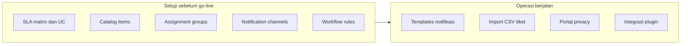

| Area | Rute | Yang dikonfigurasi |
| --- | --- | --- |
| **SLA** | `/sla` | Matrix type × priority per account; underpinning contract (UC) |
| **Katalog** | `/catalog` | Item, variabel, fulfillment steps, publish/unpublish |
| **Workflow** | `/workflows` | Trigger + aksi (email, assign, status, create ticket) |
| **Integrasi** | `/settings` | WA / Telegram / Email API keys |
| **Template** | `/settings/notifications` | Handlebars template per event |
| **Import** | `/api/import` | CSV bulk tiket |

**Event workflow yang tersedia:**

| Trigger | Contoh aksi |
| --- | --- |
| `ticket.create` | Auto-assign group, kirim email |
| `ticket.status_change` | Notify requester |
| `ticket.comment_add` | Escalate jika kata kunci |
| `inbound.message` | Balas + buat tiket |
| `alert.received` | Buat INC dari monitoring |

**Login lab:** `admin@novacrm.app`

---

## 8. Journey Inbound (otomatis)

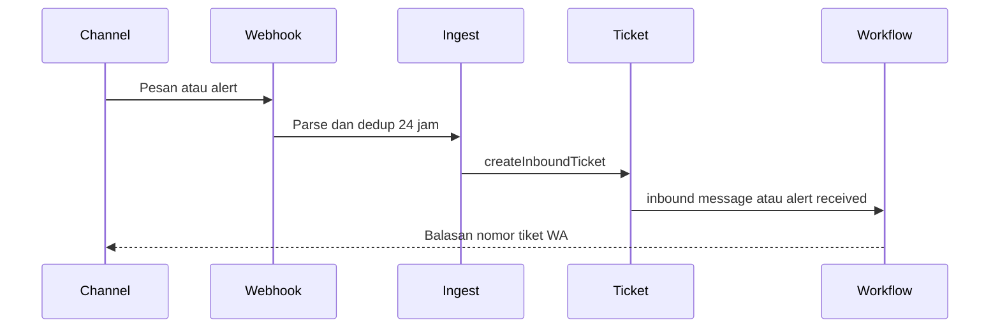

| Channel | Endpoint | Perilaku |
| --- | --- | --- |
| WhatsApp | `/api/webhooks/whatsapp` | Parse "Ticket: …" → buat INC; balas nomor |
| Telegram | `/api/webhooks/telegram` | Sama |
| Email | `/api/webhooks/email` | Subject/body → tiket |
| Generic / monitoring | `/api/webhooks/generic` | Alert → INC kategori `monitoring` |

Klasifikasi katalog otomatis jika kata kunci cocok (VPN, password, outage).

---

## 9. Notifikasi & antrian background

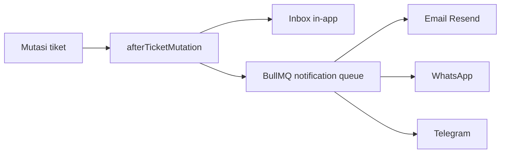

| Event | Penerima | Template |
| --- | --- | --- |
| `ticket.create` | Requester + assignee | Handlebars |
| `ticket.status_change` | Requester + assignee | Handlebars |
| `ticket.comment_add` | Requester + assignee | Handlebars |
| `ticket.assign` | Assignee baru | Handlebars |
| `major.impact` | Portal user terdampak CMDB/site/IP | Handlebars + inbox |

Worker wajib hidup: `npm run worker` (lihat [WORKERS.md](WORKERS.md)).

---

## 10. SLA, OLA & WFM (terintegrasi tiket)

| Komponen | Kapan aktif | Perilaku |
| --- | --- | --- |
| **SLA response** | Tiket dibuat | Komentar staff pertama = responded |
| **SLA resolve** | Sampai resolved/closed | Pause saat hold/waiting |
| **OLA / UC** | Jika account punya underpinning contract | Vendor/principal party |
| **WFM dispatch** | Create tanpa assignee | Auto-assign agent Available di group |

Detail WFM: [WFM-JOURNEY.md](WFM-JOURNEY.md)

Badge di UI: On track · Risk · Breached · Paused

---

## 11. Task & Delivery (perpanjangan tiket)

| Fitur | Hubungan dengan tiket |
| --- | --- |
| **Ticket tasks** | Tab Tasks di detail — WBS kegiatan fulfillment |
| **Delivery project** | Work order bisa spawn tiket CRM; customer lihat progress di portal |
| **Task activities** | Timeline aktivitas dengan dependency sequential |

Docs: [task-activities.md](user-guide/task-activities.md) · [delivery-process.md](user-guide/delivery-process.md)

---

## 12. CMDB & Asset dalam journey tiket

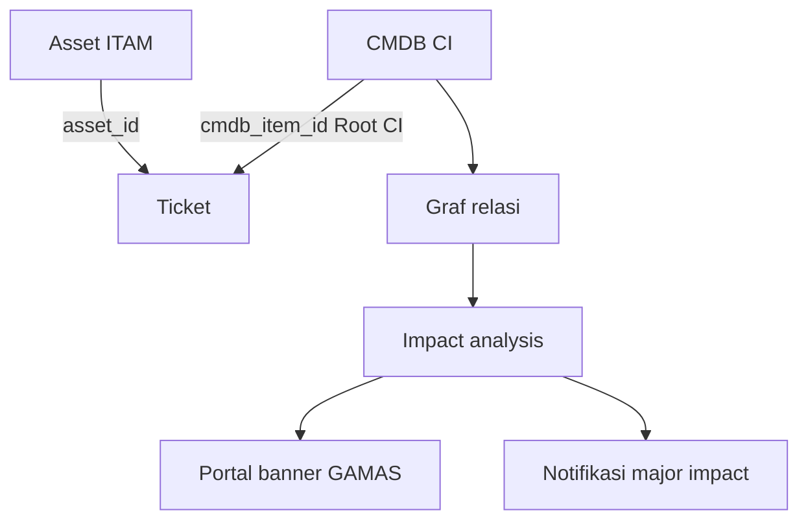

| Link | Field | Siapa set | Untuk apa |
| --- | --- | --- | --- |
| Aset hardware | `asset_id` | Agent | Riwayat perangkat, QR tag |
| Root CI major | `cmdb_item_id` | Agent (incident induk) | GAMAS impact ke portal |
| Profil customer | `site`, `client_ip` | Customer di `/portal/account` | Match lokasi & subnet |

Agent buka graf dampak di `/cmdb/{id}`. Customer tidak melihat CMDB penuh.

---

## 13. Matriks journey cepat (siapa → apa)

| Persona | Mulai dari | Journey utama | Selesai di |
| --- | --- | --- | --- |
| **Customer** | `/portal/catalog` atau `/portal/new` | Submit → komentar → CSAT | Rating 1–5 |
| **Agent L1** | Clock in → `/tickets` Unassigned | Assign → kerjakan → resolve | Closed + optional KB |
| **Agent L2/L3** | Eskalasi masuk group | Diagnosa → resolve | Closed |
| **SPV** | `/tickets` + `/cab` | Oversight major + approve change | SLA hijau |
| **Admin** | `/sla` + `/catalog` + `/workflows` | Konfigurasi sebelum operasi | Tenant siap produksi |
| **Sistem inbound** | Webhook channel | Auto-create + workflow | Balasan nomor tiket |
| **GAMAS** | INC induk + Root CI | Anak + notifikasi + portal banner | Resolve cascade |

---

## 14. Rute & file referensi

| Area | Rute UI | Kode utama |
| --- | --- | --- |
| Portal home | `/portal` | `components/portal/portal-home.tsx` |
| Portal create | `/portal/new` | `components/portal/portal-create.tsx` |
| Portal detail | `/portal/{id}` | `components/portal/portal-ticket.tsx` |
| Desk dashboard | `/tickets` | `components/tickets/ticket-dashboard.tsx` |
| Desk create | `/tickets/new` | `components/tickets/ticket-create.tsx` |
| Desk detail | `/tickets/{id}` | `components/tickets/ticket-detail.tsx` |
| CAB | `/cab` | `app/(agent)/cab/` |
| API tiket | `/api/tickets` | `lib/tickets/actions.ts` |
| GAMAS API | `/api/majors/affecting-me` | `lib/tickets/major-impact.ts` |
| Schema | — | `lib/tickets/schema.ts`, `lib/tickets/process.ts` |

---

## 15. Skenario demo terhubung

| Skenario | Durasi | Dokumen |
| --- | --- | --- |
| E2E desk + portal + CSAT | 35–70 menit | [DEMO-E2E.md](DEMO-E2E.md) |
| Major incident Bank WAN | 2 menit | [DEMO-MAJOR-INCIDENT.md](DEMO-MAJOR-INCIDENT.md) |
| Kelas peserta step-by-step | 1 hari | [participant-manual.md](user-guide/participant-manual.md) |
| Trainer agenda | — | [trainer-guide.md](user-guide/trainer-guide.md) |

**Data demo kunci (account Bank Nusantara):**

- Major induk: *WAN Bank Nusantara putus*
- Root CI: `bank-wan-indosat`
- Anak contoh: ATM Senayan, teller Kelapa Gading, RITM VPN BSD
- Customer: `customer@novacrm.app` — site Jakarta HQ, IP `10.20.3.41`

---

## 16. Checklist go-live ticketing

- [ ] SLA matrix per account customer utama
- [ ] Katalog item **Published** + variabel wajib diisi
- [ ] Assignment group L1/L2/L3 + anggota
- [ ] Notification channel (minimal email `RESEND_API_KEY`)
- [ ] Worker BullMQ berjalan
- [ ] Workflow smoke test (create → assign)
- [ ] Portal CSAT flow diuji
- [ ] (Opsional) GAMAS: CMDB seed + profil site/IP customer
- [ ] Inbound webhook diuji jika pakai WA/Telegram

---

*Terakhir diperbarui: September 2026 — mencakup P0–P2 GAMAS CMDB impact.*
