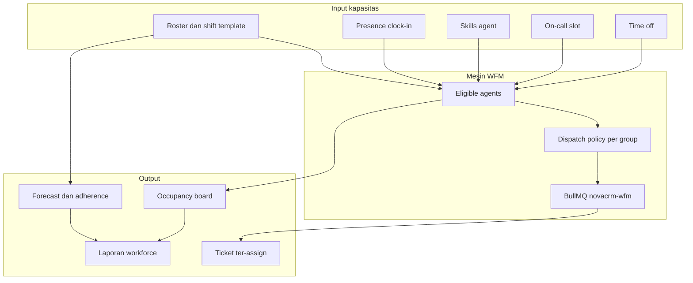
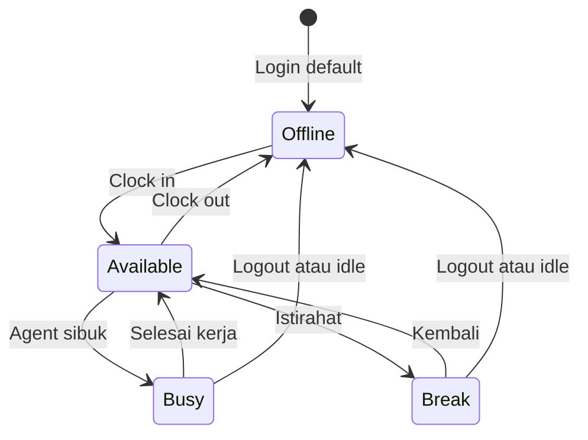
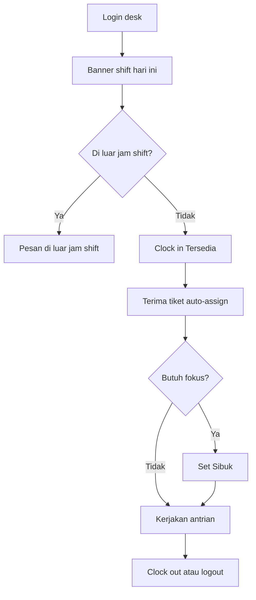
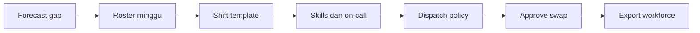
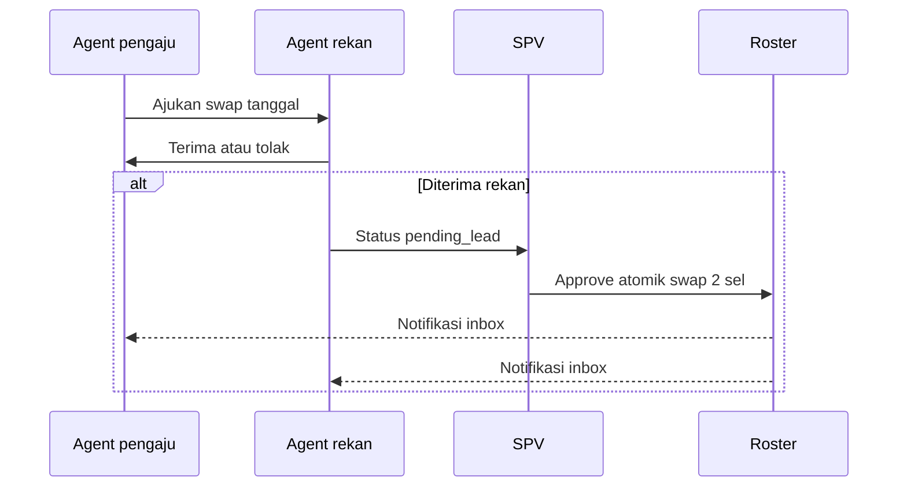
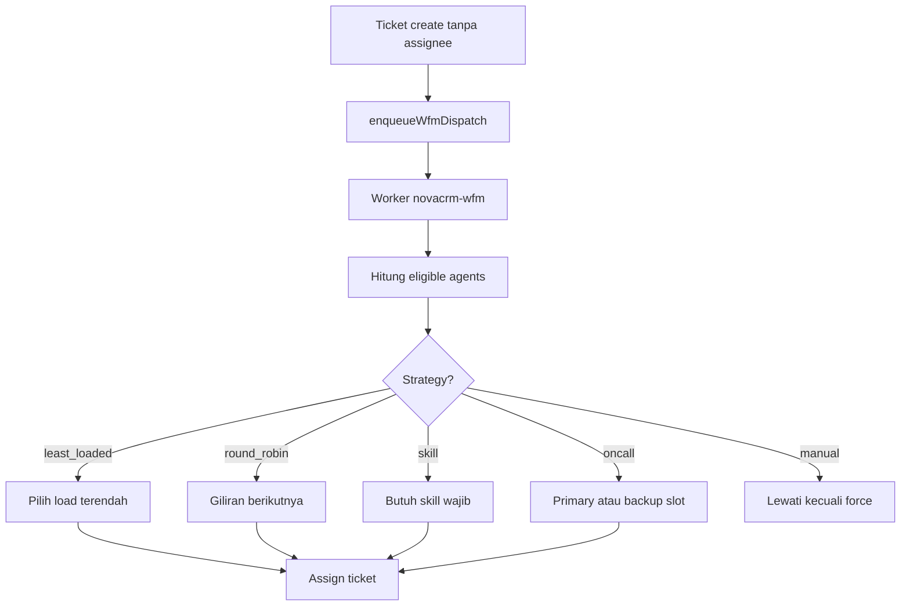
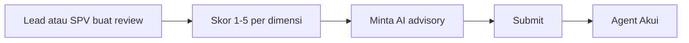
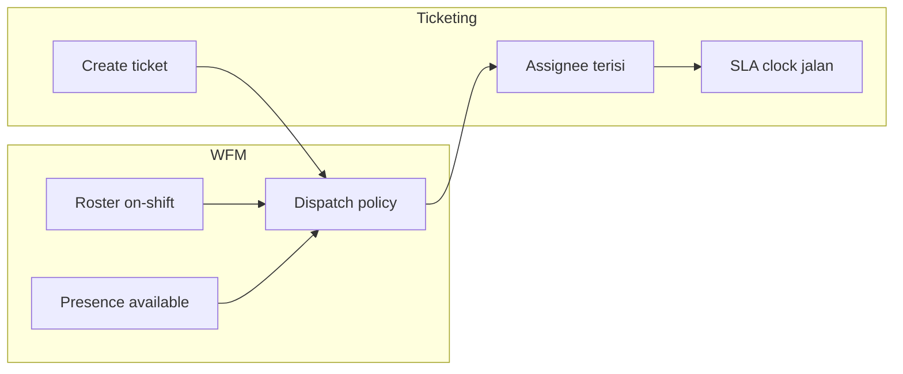

# NovaCRM — Journey Workforce Management (WFM)

**Audience:** agent, team lead, supervisor, manager, admin, trainer  
**Tujuan:** peta end-to-end tenaga kerja service desk — roster, presence, dispatch, swap, on-call, forecast, dan laporan  
**Companion:** [User operator](user-guide/user-operator.md) · [Team Lead / SPV](user-guide/lead-spv.md) · [Ticketing journey](TICKETING-JOURNEY.md) · [RBAC](RBAC.md) · [Workers](WORKERS.md)

---

## 1. Peta besar

WFM NovaCRM mengelola **kapasitas agent** dan **auto-assign tiket** berdasarkan shift, presence, skill, dan on-call.

**Aturan emas:** Login **bukan** clock-in. Default presence = **Offline** sampai agent menekan **Clock in**.

---

## 2. Menu dan rute

| Rute | Fungsi | Siapa |
| --- | --- | --- |
| `/wfm` | Occupancy board — agent per group, load, eligibility | Semua staf (read Wfm) |
| `/wfm/roster` | Grid roster mingguan | Agent: baris sendiri · SPV+: edit penuh |
| `/wfm/shifts` | Template shift Pagi, Siang, Malam, 24 jam | SPV+ tulis |
| `/wfm/swaps` | Tukar shift antar rekan | Agent ajukan · SPV setujui |
| `/wfm/skills` | Katalog skill + matrix agent | SPV+ tulis |
| `/wfm/oncall` | Rotasi on-call + slot primary/backup | SPV+ tulis |
| `/wfm/forecast` | Volume tiket vs headcount + adherence | Semua staf (read) |
| `/wfm/reviews` | Penilaian kinerja staf | Lead+ tulis · agent akui |
| `/org/groups/{id}` | **Dispatch policy** per assignment group | SPV+ tulis |
| `/reports` → Workforce | Export coverage gap + clock-in vs roster | SPV+ |

**UI global (setiap halaman desk):**

| Komponen | Lokasi | Fungsi |
| --- | --- | --- |
| Shift banner | Atas konten | Shift hari ini + Clock in/out |
| Presence control | Top bar | Tersedia · Sibuk · Istirahat · Offline |

---

## 3. Presence dan clock-in

| Status | EN | Auto-assign tiket | Masih clocked-in |
| --- | --- | --- | --- |
| **Tersedia** | Available | Ya | Ya |
| **Sibuk** | Busy | Tidak | Ya |
| **Istirahat** | Break | Tidak | Ya |
| **Offline** | Offline | Tidak | Tidak |

**Punch attendance:** setiap transisi offline ↔ non-offline tercatat di `wfm_attendance_punches` (source: manual, presence, logout, idle).

**Logout / idle timeout** otomatis set **Offline** (clock-out).

---

## 4. Journey Agent (harian)

| Langkah | Aksi | Rute |
| --- | --- | --- |
| 1 | Cek banner shift | Semua halaman desk |
| 2 | **Clock in** → Tersedia | Banner atau presence dropdown |
| 3 | Lihat beban group | `/wfm` occupancy |
| 4 | Lihat roster sendiri | `/wfm/roster` — **Roster saya** |
| 5 | Ajukan tukar shift | `/wfm/swaps` |
| 6 | Akui penilaian | `/wfm/reviews` |

**Login lab:** `sari.l1@novacrm.app` / `NovaCRM!2026` — shift Pagi 08:00–16:00, group L1 Jakarta.

**Tanpa clock-in:** presence Offline → tidak masuk pool auto-assign (assign manual SPV tetap boleh).

---

## 5. Journey Team Lead

Lead fokus **aliran antrian** + baca WFM; tidak menulis roster/skills/on-call.

| Boleh | Tidak |
| --- | --- |
| Clock-in, presence, swap request/accept | Approve swap |
| Baca occupancy, forecast, roster tim | Edit roster, shift template |
| Assign tiket (pilih agent Tersedia + on-shift) | Export workforce |
| Tulis penilaian staf | Ubah dispatch policy |

**Login lab:** `lead@novacrm.app`

**Ritual pagi:** Unassigned → SLA risk → My groups → cek occupancy siapa **Tersedia** dan on-shift.

---

## 6. Journey Supervisor (SPV)

| Langkah | Rute | Detail |
| --- | --- | --- |
| 1 | `/wfm/forecast` | Cek gap volume vs headcount + adherence |
| 2 | `/wfm/roster` | Terapkan minggu atau import CSV/Excel |
| 3 | `/wfm/shifts` | Edit jam Pagi/Siang/Malam atau buat template baru |
| 4 | `/wfm/skills` | Skill Network, Endpoint, dll. + level agent |
| 5 | `/wfm/oncall` | Rotasi + slot primary/backup |
| 6 | `/org/groups/{id}` | Strategy dispatch per group |
| 7 | `/wfm/swaps` | Setujui pending_lead |
| 8 | `/reports` → Workforce | Export coverage + clock-in |

**Login lab:** `spv@novacrm.app`

### Roster (SPV/admin)

| Metode | Cara |
| --- | --- |
| Apply week | Pilih group + shift → **Terapkan ke minggu ini** |
| Import CSV/Excel | Kolom: date, email/name, group, shift |
| Edit sel | Klik sel kosong = tambah; sel terisi = ganti/hapus |

Template roster: `GET /api/wfm/roster/template?format=csv|xlsx`

### Shift template default

| Nama | Jam (lab) | Hari |
| --- | --- | --- |
| Pagi | 08:00–16:00 | Sen–Jum |
| Siang | 12:00–20:00 | Sen–Jum |
| Malam | 21:00–05:00 | — |
| 24 jam | 24 jam | Setiap hari |

Edit jam di `/wfm/shifts` — semua sel roster yang memakai template ikut jam baru. Minggu berbeda jam → **buat template baru**, jangan timpa yang lama.

---

## 7. Journey Tukar shift

| Status swap | Arti |
| --- | --- |
| `pending_peer` | Menunggu rekan |
| `pending_lead` | Rekan terima, menunggu SPV |
| `approved` | Roster sudah ditukar |
| `rejected` | Ditolak |
| `cancelled` | Dibatalkan |

**Lonceng inbox:** rekan saat diajukan · pengaju saat diterima/ditolak · SPV saat menunggu approval.

**Jangan** tukar shift dengan edit sel roster manual — gunakan `/wfm/swaps`.

---

## 8. Dispatch policy dan auto-assign

Konfigurasi di **Organization → Assignment group → Save dispatch** (`/org/groups/{id}`).

### Strategy dispatch

| Strategy | Perilaku |
| --- | --- |
| `manual` | Tidak auto-assign (kecuali force) |
| `least_loaded` | Agent Tersedia dengan tiket open paling sedikit |
| `round_robin` | Giliran dari `last_assignee_id` |
| `skill` | Hanya agent dengan skill wajib di policy |
| `oncall` | Primary/backup dari slot on-call aktif |

### Syarat eligible

| Cek | Jika gagal |
| --- | --- |
| On shift (roster ada) | `off_shift` |
| Tidak cuti approved | `on_leave` |
| Presence **available** | `offline`, `busy` |
| Di bawah `max_open_tickets` | `at_cap` |
| Punya skill wajib | `missing_skill` |

**Fallback on-call:** jika group L1 tidak ada eligible, policy bisa arahkan ke group on-call (`oncall_group_id`).

### Trigger dispatch

| Event | Mekanisme |
| --- | --- |
| Ticket create (tanpa assignee) | BullMQ async `enqueueWfmDispatch` |
| Escalate (group baru, assignee kosong) | `dispatchTicket` sync force |
| Workflow action assign=wfm | Worker workflow |
| Tombol Dispatch di detail tiket | Manual re-dispatch force |

**Worker wajib:** `npm run worker` — queue `novacrm-wfm`. Tanpa Redis, fallback inline (lihat [WORKERS.md](WORKERS.md)).

### Policy demo (seed)

| Group | Strategy | Max open | Catatan |
| --- | --- | --- | --- |
| L1 Jakarta | least_loaded | 6 | Fallback Network On-call |
| Bank L1 | round_robin | 8 | — |
| L2 Network | skill | 5 | Butuh skill Network |
| L3 Infra | skill | 4 | Butuh skill Database |
| CAB Infra | manual | 8 | — |
| Network On-call | oncall | 10 | — |

---

## 9. Skills dan on-call

### Skills

| Langkah | Rute | Detail |
| --- | --- | --- |
| 1 | `/wfm/skills` | Buat skill (Network, Endpoint, Database, Identity) |
| 2 | Matrix | Assign level 1–5 per agent |
| 3 | Dispatch | Group L2/L3 pakai strategy `skill` + `required_skill_ids` |

### On-call

| Langkah | Rute | Detail |
| --- | --- | --- |
| 1 | `/wfm/oncall` | Buat rotation (mis. Network weekly) |
| 2 | Slot | Primary + backup user per window |
| 3 | Dispatch | Group strategy `oncall` ambil dari slot aktif |

**Demo:** `andi.oncall@novacrm.app` primary · `raka.l2@novacrm.app` backup — rotation Network weekly.

---

## 10. Forecast dan adherence

**Rute:** `/wfm/forecast`

| Metrik | Arti |
| --- | --- |
| **Volume forecast** | Rata-rata tiket 8 minggu per weekday vs headcount roster minggu ini |
| **Gap** | Volume tinggi + headcount rendah → risiko SLA |
| **Adherence** | Agent dalam jam shift vs presence available/busy |

**Scope:** forecast mengikuti **filter account** sidebar. Roster/skills/on-call **tenant-wide**.

---

## 11. Time off (cuti)

| Tipe | Status flow |
| --- | --- |
| leave · sick · training · other | `pending` → `approved` atau `rejected` |

- Agent submit → pending (SPV approve)
- SPV create → auto approved
- Cuti approved → agent **tidak eligible** dispatch (`on_leave`)

**Demo:** `dewi.l1@novacrm.app` punya leave approved besok.

---

## 12. Penilaian staf (Staff reviews)

**Rute:** `/wfm/reviews` — subject CASL terpisah (`StaffReview`)

| Dimensi skor | Skala |
| --- | --- |
| Quality | 1–5 |
| SLA discipline | 1–5 |
| Teamwork | 1–5 |
| Ownership | 1–5 |

Status: `draft` → `submitted` → `acknowledged`

---

## 13. Laporan dan export

| Export | Akses | Output |
| --- | --- | --- |
| **Workforce** | SPV+ | CSV/Excel: Coverage gaps + Clock-in vs roster |
| **Roster template** | Read Wfm | Blank CSV/XLSX untuk import |

**Endpoint:** `/api/reports/export?kind=workforce&format=csv|xlsx`

**Coverage gaps:** satu baris per group × hari tanpa headcount (termasuk weekend jika shift Sen–Jum).

**Clock-in vs roster:** bandingkan punch dengan roster terencana.

Filename: `novacrm-wfm-{from}-{to}.{csv|xlsx}`

---

## 14. Integrasi dengan ticketing

| Situasi | Perilaku WFM |
| --- | --- |
| Agent clock-in Tersedia + on-shift | Masuk pool auto-assign |
| Agent Sibuk/Istirahat | Tidak auto-assign; tiket existing tetap |
| Escalate L2/L3 | Assignee cleared → re-dispatch ke group baru |
| Hold tiket | SLA pause; WFM tidak relevan |
| Manual assign SPV | Bypass dispatch; pilih agent Tersedia dari occupancy |

Detail ticketing: [TICKETING-JOURNEY.md](TICKETING-JOURNEY.md) §4.1 dan §10.

---

## 15. Matriks hak per role

| Kemampuan | agent | team_lead | supervisor | manager | admin |
| --- | :---: | :---: | :---: | :---: | :---: |
| Baca WFM pages | ● | ● | ● | ● | ● |
| Clock-in / presence sendiri | ● | ● | ● | ● | ● |
| Roster saya + swap request | ● | ● | ● | ● | ● |
| Approve swap | | | ● | ● | ● |
| Tulis roster / shift / skills / on-call | | | ● | ● | ● |
| Dispatch policy write | | | ● | ● | ● |
| Export workforce | | | ● | ● | ● |
| Tulis staff review | | ● | ● | ● | ● |
| Akui review sendiri | ● | ● | ● | ● | ● |

Detail: [RBAC.md](RBAC.md)

---

## 16. Data demo

**Password lab:** `NovaCRM!2026`

| Email | Role | WFM context |
| --- | --- | --- |
| `sari.l1@novacrm.app` | agent | L1 Pagi, roster 14 hari |
| `budi.l1@novacrm.app` | agent | L1 Pagi — partner swap lab |
| `dewi.l1@novacrm.app` | agent | L1 Siang, leave besok |
| `raka.l2@novacrm.app` | agent | L2 Network + on-call |
| `maya.l3@novacrm.app` | agent | L3 Infra |
| `andi.oncall@novacrm.app` | agent | Network on-call lead |
| `lead@novacrm.app` | team_lead | Baca WFM, tulis review |
| `spv@novacrm.app` | supervisor | Roster, approve swap, export |

**Skills seed:** Network · Endpoint · Database · Identity

---

## 17. Checklist operasional

### Agent (setiap shift)

- [ ] Clock in sebelum ambil antrian baru
- [ ] Set Sibuk saat handle tiket panjang (optional)
- [ ] Clock out saat selesai shift
- [ ] Tukar shift lewat `/wfm/swaps`, bukan edit roster

### SPV (mingguan)

- [ ] Roster minggu depan terisi
- [ ] Forecast gap ditindaklanjuti (tambah headcount atau shift)
- [ ] Swap pending_lead diputus hari yang sama
- [ ] Export workforce — cek coverage gaps
- [ ] Dispatch policy sesuai beban group
- [ ] On-call slot minggu ini valid
- [ ] Worker Redis + BullMQ hidup

### Go-live WFM

- [ ] Assignment group L1/L2/L3 ada anggota
- [ ] Shift template aktif
- [ ] Roster minimal 2 minggu ke depan
- [ ] Dispatch policy bukan `manual` untuk L1 (jika mau auto-assign)
- [ ] Skills di-assign untuk group skill-based
- [ ] Worker `novacrm-wfm` running
- [ ] Uji: create ticket unassigned → assign otomatis ke agent Tersedia

---

## 18. Masalah yang sering

| Gejala | Penyebab | Perbaikan |
| --- | --- | --- |
| Tidak dapat auto-assign | Belum clock-in | Agent Clock in Tersedia |
| Tidak dapat auto-assign | Worker mati | `npm run worker`, cek Redis |
| Tidak dapat auto-assign | Strategy manual | Ubah policy group ke least_loaded |
| Agent overload | max_open_tickets kecil | Naikkan cap di dispatch policy |
| Swap gagal | Edit roster manual | Pakai `/wfm/swaps` + approve SPV |
| Forecast kosong | Belum ada histori tiket | Normal di tenant baru |
| Roster agent kosong | SPV belum apply | Terapkan minggu atau import |
| Off shift tapi Tersedia | Roster tidak cocok tanggal | Cek `/wfm/roster` |

---

## 19. Model data dan kode referensi

### Tabel utama

| Tabel | Fungsi |
| --- | --- |
| `wfm_presence` | Status agent saat ini |
| `wfm_shift_templates` | Definisi jam shift |
| `wfm_roster_entries` | Siapa shift apa hari apa |
| `wfm_dispatch_policies` | Strategy per assignment group |
| `wfm_skills` · `wfm_agent_skills` | Skill matrix |
| `wfm_oncall_rotations` · `wfm_oncall_slots` | On-call |
| `wfm_shift_swaps` · `wfm_shift_swap_events` | Tukar shift + audit |
| `wfm_attendance_punches` | Clock-in/out log |
| `wfm_time_off` | Cuti |
| `staff_reviews` | Penilaian kinerja |

### Migrations

`20250814120000_wfm.sql` · `20250818180000_wfm_default_shifts.sql` · `20250818190000_wfm_attendance.sql` · `20250818200000_wfm_roster_write.sql` · `20250818210000_wfm_shift_swaps.sql` · `20250818220000_wfm_shift_template_write.sql`

### Kode

| Area | Path |
| --- | --- |
| Server actions | `lib/wfm/actions.ts`, `lib/wfm/swap-actions.ts` |
| Dispatch | `lib/wfm/dispatch.ts`, `lib/wfm/eligible.ts` |
| Forecast | `lib/wfm/forecast.ts` |
| Queue | `lib/queue/wfm.queue.ts`, `lib/queue/wfm.processor.ts` |
| Export | `lib/reports/wfm-export.ts` |
| UI | `components/wfm/*`, `components/layout/shift-banner.tsx` |

---

## 20. Skenario demo terhubung

| Skenario | Durasi | Dokumen |
| --- | --- | --- |
| Clock-in + occupancy | 5 menit | Lab 11b di [participant-manual.md](user-guide/participant-manual.md) |
| E2E desk + WFM export | 35–70 menit | [DEMO-E2E.md](DEMO-E2E.md) |
| SPV roster + swap | 15 menit | [lead-spv.md](user-guide/lead-spv.md) §8 |

---

*Terakhir diperbarui: September 2026*
